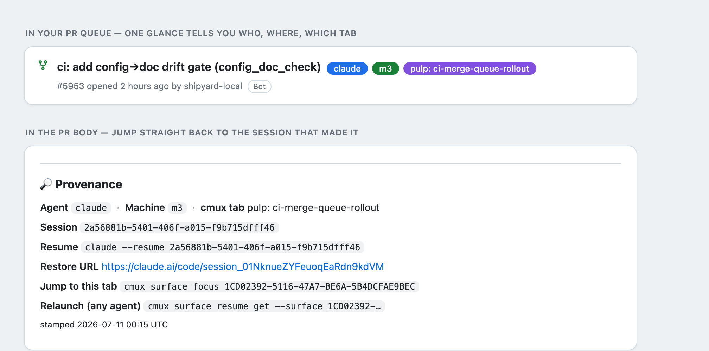

# whence

*Whence came this pull request?*

**Trace every PR back to the agent, machine, and terminal tab that made it — so you can jump straight back to the session that's still running.**

If you drive a lot of AI coding agents (Claude Code, Codex) across several
machines and a wall of [cmux](https://cmux.com) tabs, your PR queue turns into a
black box: every PR is opened by the same bot, and there's no way to tell *which
agent, on which machine, in which tab* pushed it. When something needs a
follow-up you have no idea which of your twelve open sessions to go ask.

`whence` fixes that. On every PR it stamps:

- **Color-coded queue labels** — the agent (any cmux agent — `claude`, `codex`,
  `opencode`, `gemini`, `cursor`, …), the machine (any name you choose), the cmux
  **workspace** name, and the **tab** title — so the queue is legible at a glance.
  (Two tabs sharing a title get the cmux `surface:N` ref appended so you can still
  tell them apart.)

  The workspace label appears only if you **named** the workspace. cmux auto-titles
  an unnamed one after a tab inside it, so an auto-title is just some tab's name —
  as a "workspace" label it is at best a duplicate and at worst a *different* tab's
  title, which reads like whence mislabelled the PR. Name a workspace to opt into
  the label; leave it unnamed and you get agent/host/tab only.
### Keeping names you can\'t publish off a public PR

cmux derives a tab\'s title from the agent\'s prompt, so a title like *"port the
AcmeSynth reverb"* would otherwise land verbatim as a label — and in the footer — on a
public PR. Two facts make this need handling in whence: cmux offers **no way to
rename a tab** (there is a `workspace.rename` RPC but no surface equivalent), and a
label, once created, lingers in the repo\'s label picker even after it\'s pulled
off a PR.

Set a **denylist** in the config — case-insensitive substrings:

```json
"denylist": ["acmesynth", "widgetworks", "unreleased-codename"],
"redact_placeholder": "(redacted)"
```

Any tab or workspace title containing one of these is scrubbed **before** it can
become a label or appear in the footer. It fails closed (a title that merely
embeds a denied token is redacted), and it only ever touches the free-form *name*
fields — the session id, resume command, and jump/relaunch surface UUIDs are opaque
handles, never names, so a redacted PR is still fully navigable. A denied tab keeps
its name-free cmux ref (`surface:16`) as its label where one is available; a denied
workspace drops to the placeholder.

Redaction stops whence from *creating* a denied label. To remove ones that already
leaked (created before you added the term, or by another tool), run:

```bash
whence --gc-labels owner/repo     # deletes every repo label that trips the denylist
```

It\'s explicit and per-repo on purpose — deleting a label removes it from every PR
at once, so it never runs on a timer.

**On renames after a PR is opened:** the label is **frozen at stamp time** — it
records what the tab was called when it opened the PR, and does not chase later
renames (a label that mutates as you work is noise, not signal). A re-stamp
*replaces* the old label rather than stacking a second one, but nothing triggers it
automatically; run `whence --resync` from that tab to refresh its open PRs to the
current name. The denylist is the one thing that always wins, at every stamp.

- **A visible "🔎 Provenance" footer** in the PR body with the **session id**,
  the exact **resume command** (`claude --resume …` / `codex resume …`), the
  restorable **`claude.ai/code` URL**, and a **jump-to-tab** command
  (`cmux surface focus …`).



## Why it exists

Multi-agent, multi-machine development is fast but disorienting. You kick off
work in one tab, switch to another, come back an hour later to a queue of PRs and
no memory of which was which. The one thing you always want is **"take me back to
the session that did this."** That requires four facts, captured at push time,
attached to the PR:

| Fact | Where it comes from |
|------|---------------------|
| Which agent | cmux `CMUX_AGENT_LAUNCH_KIND` (or `CLAUDECODE` / `CODEX_*`) |
| Which machine | a one-token `~/.config/whence/host-label` you set per machine |
| Which tab | `cmux rpc surface.list` → the tab's human name |
| How to resume it | `cmux surface resume get` → the exact relaunch command, for **any** agent |

The clever bit: cmux already stores the exact restore command per tab, so Codex
and Claude are handled by the *same* code path — no agent-specific guessing.

## Setup & scope — install once, opt in per repo

`whence` is a single script, not a background service. **Nothing runs until you
run it** (or wire a hook). Setup is **once per machine**:

```bash
git clone https://github.com/danielraffel/whence     # put `whence` on your PATH
whence --setup --host m3                               # name this machine + install the every-PR hook
# also needs: python3, a GitHub CLI (gh or ghapp), and cmux for the tab/session fields
```

`whence --setup` is the guided one-shot: it names the machine, writes the config
(auto-selecting `gh` or `ghapp` based on what's installed), installs the
every-future-PR hook, and prints exactly **which PR commands it will catch** on
this machine. Prefer to do it in pieces? `whence --init` (config),
`echo m3 > ~/.config/whence/host-label` (name), `whence --install-hook` (hook)
are the same steps by hand.

After that it works in **every repo you run it in** — there is no per-repo
install. GitHub labels are per-repo, so the first time it stamps in a given repo
it auto-creates the `agent` / `machine` / `tab` labels there; you never make
labels by hand.

**Will it stamp all my repos, or just one?** Entirely up to how you wire the
auto-stamp — and you can scope it either way:

| You want… | Do this |
|-----------|---------|
| Stamp by hand, any repo | run `whence --apply` when you want |
| Auto-stamp **every** repo | a global shell alias or Claude Code hook (`~/.claude/settings.json`) running `whence --auto` |
| Auto-stamp **one** repo | a project hook in that repo's `.claude/settings.json` |
| Turn it off in **one repo**, instantly | drop an empty `.whence-off` file in that repo's root (`touch .whence-off`) — gitignore it to keep it private, or commit it to disable for everyone |
| Global hook, but **skip** some repos | `"repos": {"mode":"deny","list":["owner/secret"]}` in config |
| Global hook, but **only** certain repos | `"repos": {"mode":"allow","list":["owner/a","owner/b"]}` |

So there are two independent off-switches for repos: a **`.whence-off` file in the
repo** (local, instant, no config) and the **`repos` list in your global config**
(central). Either one turns it off.

`whence --auto` is the hook-safe mode: it applies quietly and **exits without
touching anything** if the repo is excluded or the branch has no PR yet — so one
global hook is safe to leave on everywhere and gate per-repo from config.

## Use

```bash
# preview what would be stamped (no changes):
whence --pr 1234

# stamp it:
whence --pr 1234 --apply

# or let it find the PR for the current branch:
whence --apply
```

Re-running is idempotent — it replaces its own labels/footer, never piling up.

### Auto-stamp on every PR

There are two triggers; they're idempotent, so use either or both.

**Reliable — your agent's own hook.** An agent hook fires *in the agent's
process*, so it always runs regardless of how the agent shells out. It's the
dependable choice for "every PR this agent opens gets stamped." One command wires
it:

```bash
whence --install-agent-hook          # Claude + Codex, both global
whence --install-agent-hook claude   # just Claude
whence --install-agent-hook codex    # just Codex
```

It writes a small `pr-hook.sh` and registers a `PostToolUse` hook that runs
`whence --hook` — which reads the tool call and stamps only when the command
actually opened a PR (`gh`/`ghapp pr create`, `shipyard pr`, `pulp pr`). Both are
**global, once per machine**: Claude via `~/.claude/settings.json`, Codex via
`~/.codex/hooks.json` — no per-repo install. Codex gates hooks behind trust, so
it asks you to trust the whence hook once on its next run. (cmux also wires
Claude's hooks automatically.) See
[`examples/claude-code-hook.md`](examples/claude-code-hook.md) for the manual form.

**Best-effort, zero per-agent config — the shell hook.**

```bash
whence --install-hook          # once per machine
```

This wraps the *command that opens the PR* with a small **shell function**
(written to `~/.config/whence/hook.sh`, sourced from `~/.zshenv`) that stamps the
branch's PR right after. It covers **every common way a PR gets opened** —
`gh pr create`, `ghapp pr create`, `shipyard pr`, `pulp pr` (whichever you have)
— with no per-agent config and no Shipyard dependency. A function beats `PATH`
(so a `.zshrc` PATH reorder can't shadow it) and calls the real tool via
`command` (no recursion, no double-stamp).

Its limit, honestly: it only fires in shells that load your init file, so it
catches PRs you open in a normal terminal and in agents whose command shell
sources `~/.zshenv` — but an agent that runs commands in a bare shell
(`bash -c`, no rc) won't trigger it. That's why the agent hook above is the
reliable path; the shell hook is a convenient net for everything else. Over-firing
is harmless (whence no-ops when the branch has no PR). Uninstall with
`whence --uninstall-hook`.

> **zsh note:** `whence` is a zsh builtin (like `which`), so at an interactive
> zsh prompt run **`command whence …`** (or the full path) to reach this tool.
> The hooks already do this internally; it only matters when you type it by hand.

Why a command shim and not "an agent hook": each agent's hook system is a
*different* config, and most of cmux's agents have no PR-time hook at all. The PR
command is the one layer they all share. The shim runs in the agent's own shell,
so the session/tab it captures is real; it never blocks or changes the PR
command's result; and because stamping is idempotent, it's safe even if a second
mechanism (below) also fires.

```bash
whence --print-hook            # see exactly what it would install, write nothing
```

The functions live in `~/.config/whence/hook.sh`, sourced by a clearly-marked
block in `~/.zshenv` (and `~/.bashrc` if present). `whence --uninstall-hook`
removes both.

**Keep a tab's PRs current.** whence captures the tab title at PR-open. If you
rename a tab later and want its already-open PRs updated, run `whence --resync`
from that tab — it finds this tab's open PRs (by the surface id already in their
footers — no tracking, no daemon) and re-stamps them with the current name.

**Other ways** (optional; they coexist with the shim — stamping is idempotent):

- **Claude Code / Codex hook** — if you'd rather trigger from the agent. See
  [`examples/claude-code-hook.md`](examples/claude-code-hook.md).
- **Merge orchestrators** (e.g. Shipyard) — stamp centrally at the PR-open step.
  See [`examples/shipyard.md`](examples/shipyard.md).
- **As an agent skill** — [`skill/SKILL.md`](skill/SKILL.md) tells an agent to
  stamp its PR right after opening it.

### Catching every PR — read the output, then sweep

**Never infer the repo or branch from the current directory.** An agent's hook
runs in the *session's* project root, which is not the worktree the command ran
in — so a PR shipped from a worktree resolves the wrong branch and is silently
dropped. Nothing warns you; the label just never appears.

Instead, whence reads the command's own **output**, which names the outcome no
matter what shelled out to what:

| the command printed | whence learns |
|---|---|
| `https://github.com/o/r/pull/123` (`gh pr create`, an orchestrator) | the repo **and** the PR — stamp it now |
| `To github.com:o/r.git` + `fix/x -> fix/x` (`git push`) | the repo **and** the branch — no PR yet, so remember it |

This is why it works for `gh`, `shipyard`, `pulp`, a bare `git push`, or a script
of your own: none of them can push code without saying where it went.

1. **Capture.** A push records `owner/repo#branch → {agent, host, workspace, tab,
   session}` into `~/.config/whence/branch-ledger.json`. The env is live at that
   moment, so the tab is captured correctly.

   When the command produced no output to read — a **backgrounded** `shipyard pr`
   hands the agent a task handle and opens the PR minutes later — whence falls back
   to the `cd` in the command text, which is the only thing left that names the
   worktree. It reads `cd X && …`, a `cd` on its own line, `cd "$WT"` against a
   variable the same command set, and `git -C X`.
2. **Targeted retry.** If a PR-producing command returns before it can print a PR
   URL, whence starts a detached retry for that exact repo/branch. It polls for up
   to two minutes and stamps as soon as GitHub exposes the PR, without blocking
   the agent hook or scanning unrelated ledger entries. This closes the common
   20–60 second Shipyard creation gap instead of leaving the PR unlabeled until
   the global timer fires.
3. **Sweep.** `whence --sweep` stamps any PR whose head branch is in the ledger
   but isn't stamped yet, using the *ledger's* provenance (the tab that made the
   branch) — never the sweeping machine's. It covers **merged and closed** PRs,
   not just open ones: an orchestrator that merges on green closes the PR within
   minutes, and those are exactly the PRs you later want to trace back.

The sweep runs on a **timer** (`whence --install-sweep`, every 10 min), not only
when an agent happens to fire the hook again — otherwise the last PR of a session
would wait forever for a next command that never comes. Once an entry is stamped
it is marked done, so a steady-state sweep costs no API calls. `whence --setup`
installs the timer for you; run it by hand any time with `whence --sweep`.

### Keeping several machines in sync

If you drive whence from more than one machine, you want a change made on *any*
one of them to reach the others — without caring which machine you edited on. The
repo is the source of truth; two mechanisms keep every machine current:

- **Automatic (self-update).** On its next stamp, each machine fast-forwards its
  own clone to the repo (throttled to once/day) and reinstalls the hook if
  anything moved. Zero setup, no cron — a machine that was offline catches up on
  its own. Force it now with `whence --self-update`.
- **Instant (deploy fan-out).** Right after you push a change, `whence --deploy`
  pushes your local commits, then SSHes each host in `~/.config/whence/hosts`
  (one hostname per line) to pull + reinstall immediately. Unreachable hosts are
  skipped — they'll self-update on their next stamp.

The host list is **personal** — it lives only in `~/.config/whence/hosts`, never
in the repo, because your fleet is yours. Most whence users run one machine and
never touch any of this; it's here for the multi-machine case.

#### Syncing your *config* across machines (denylist, colors, toggles)

The code syncs via the repo above, but `~/.config/whence/config.json` is
per-machine — so a denylist term you add on one machine wouldn't reach the others.
Point whence at a **private** git repo to fix that (keep it private: your denylist
names the very things you don't want public):

```bash
whence --init-config-repo git@github.com:you/whence-config.git
```

That clones the repo to `~/.config/whence/config-repo` and seeds it from this
machine. From then on:

- **Outbound** — `whence --push-config` writes your config to the repo and pushes.
  `whence --install-config-watch` arms a launchd watcher so an *edit auto-pushes
  the moment you save* — nothing to remember.
- **Inbound** — every machine pulls the repo on its **sweep tick** (the 10-minute
  timer it already runs). This is the offline catch-up: a machine that was asleep
  when you edited converges within ten minutes of waking. Force it now with
  `whence --pull-config`.

Only the **shareable** fields travel — the machine-local `gh` (which GitHub CLI
this box uses) is never overwritten, and identity lives in the separate
`host-label` file. It's loop-safe: a push commits only when the config actually
changed, and a pull writes only when it differs, so an edit propagates once and
settles. The repo doubles as a versioned **backup** of your config.

#### Set up a new machine (full recipe)

`whence --setup` covers a **solo** machine. To join a fleet that shares one config
+ backup, it's four commands, in order:

```bash
git clone https://github.com/danielraffel/whence               # put `whence` on PATH
whence --setup --host <name>                                   # config + PR hook + agent hooks + sweep timer
whence --init-config-repo git@github.com:you/whence-config.git # clone the shared config, pull the denylist
whence --install-config-watch                                  # auto-push config edits from this machine
```

The first two lines are all a standalone machine needs. The last two opt it into
the shared, backed-up config: after them, this machine **pulls** fleet config on
its sweep tick and **pushes** any edit you make here. Nothing else to wire — the
`gh`/`ghapp` CLI, `python3`, and `cmux` are the only prerequisites.

## Configure anything — one file, every knob

Everything is on by default; turn off whatever you want. Run **`whence --init`**
to drop a fully-populated config at `~/.config/whence/config.json`, then flip
values. **`whence --show`** prints the file's location and your effective
settings any time (so you never have to wonder where it lives).

```json
{
  "fields": {
    "agent": true, "host": true, "workspace": true, "tab": true,
    "session": true, "resume": true, "url": true,
    "jump": true, "relaunch": true, "stamped": true
  },
  "labels": true,
  "footer": true,
  "colors": { "agent": "1f6feb", "host": "1a7f37", "workspace": "bf8700", "tab": "8250df" },
  "repos": { "mode": "all", "list": [] },
  "gh": "gh",
  "label_maxlen": 24
}
```

Long tab/workspace names are clipped to `label_maxlen` chars (default 24) with a
`…` on the **queue label** only — the **footer always keeps the full name**. Set
it shorter or longer to taste.

| To drop… | Set |
|----------|-----|
| the **machine name** | `"fields": { "host": false }` |
| the **agent name** | `"fields": { "agent": false }` |
| the tab / session / url / any field | `"fields": { "url": false }`, … |
| the **whole PR-description footer** (keep labels) | `"footer": false` |
| the **labels** (keep footer) | `"labels": false` |

A field set false disappears from **both** the labels and the footer. Prefer a
one-off? `--hide host,agent`, `--no-footer`, `--no-labels`, or
`WHENCE_HIDE=url,session` do the same without editing the file.

**Colors:** any GitHub label hex, per category. **Machine label:**
`WHENCE_HOST_LABEL` env beats the `host-label` file. **`gh` binary:** set
`"gh": "ghapp"` in config (or `WHENCE_GH=ghapp`) to authenticate as a GitHub
App instead of the shared personal token.

## Any agent, any machine

The agent label is whatever cmux reports (`CMUX_AGENT_LAUNCH_KIND`), so it works
for every agent cmux launches — **claude, codex, grok, opencode, pi, omp, amp,
cursor, gemini, kiro, antigravity, rovodev, hermes-agent, copilot, codebuddy,
factory, qoder** — with no per-agent setup. The **resume** line is pretty-printed
for agents whose CLI syntax is known (claude, codex; easy to add more), and the
**relaunch** line (`cmux surface resume get`) is cmux's own restore command, which
is correct for *any* agent. Machine names are free-form — whatever token you drop
in `host-label`.

**No cmux?** You still get the `agent` + `machine` labels and whatever session
handle the agent exposes; cmux just adds the tab name and the universal resume.

### Label order — agent, host, workspace, tab

whence adds labels in agent→host→workspace→tab order, but **GitHub decides how the
chips display**, and — confirmed by reading the rendered DOM — it uses *two
different* sort orders depending on where you look:

| Surface | GitHub sorts by | How to control it |
|---|---|---|
| PR **list / queue** (what you scan) | label **name**, alphabetically | `order_labels` (below) |
| PR **detail** page / REST API | label **creation id** | `--reorder-labels` |

Neither honors the order whence adds them in, so ordering takes a deliberate step.

**For the queue — `order_labels` (recommended).** Set `"order_labels": true` in
config and whence prefixes each chip `1·`/`2·`/`3·`/`4·` by role, so the
alphabetical sort renders agent → host → workspace → tab on every PR. Only the chip
carries the prefix; the provenance footer shows the clean value. Off by default.

**For the detail page / API — `whence --reorder-labels owner/repo`.** GitHub sorts
those surfaces by label creation id, so this deletes and recreates each whence
label (classified by its color, so unrelated repo labels are untouched) in role
order — agents first (lowest ids), tabs last — then re-applies them to the open
PRs. Deleting a label also removes it from *closed* PRs; the footer is never
touched. New tab labels get the newest ids and sort last on their own, so re-run it
only if a new agent/host/workspace value appears.

The **footer table** always renders in agent/host/workspace/tab order regardless —
that layout is ours to control, not GitHub's.

## Debugging — an audit log of every label change

whence stamps silently, so if a label ever looks wrong there's normally nothing to
inspect but the current footer (which shows the *end* state, never the change that
produced it). Turn on a lightweight, default-off audit log to capture the
transitions:

```bash
whence --audit on     # flip audit_log in config (syncs to the fleet); off by default
whence --log          # show the last 20 changes
whence --log 100      # ...or the last N
whence --audit off    # when you're done validating
```

Every real label **change** appends one JSONL line to `~/.config/whence/audit.jsonl`
with the timestamp, the PR, the **source** (`hook` = live stamp, `retry` = delayed
PR appeared, `sweep:new`, `sweep:heal` = self-heal, `manual`), the `agent@host` that made it, and the
**before → after** labels. A no-op re-stamp writes nothing. `whence --log` renders it:

```
2026-07-15 16:37:37 UTC  #6142 danielraffel/pulp  [hook]  codex@m5
    [unknown, m5, w1, plugin hosting]  ->  [codex, m5, w1, plugin hosting]
```

It's a debug switch — flip it on to validate behavior for a while, then off. The log
is per-machine (each machine records its own writes), and because the `audit_log`
flag lives in the synced config, turning it on or off reaches the whole fleet.

## What it doesn't do

There's no clickable `cmux://` deep-link — cmux only registers its URL scheme
for auth — so "jump to tab" is a copy-paste `cmux surface focus <id>` command.
If cmux ships a workspace-open URL, this will use it.

## License

MIT © Daniel Raffel
